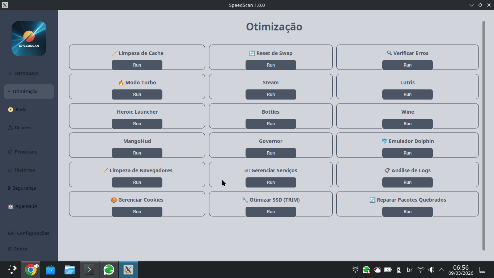
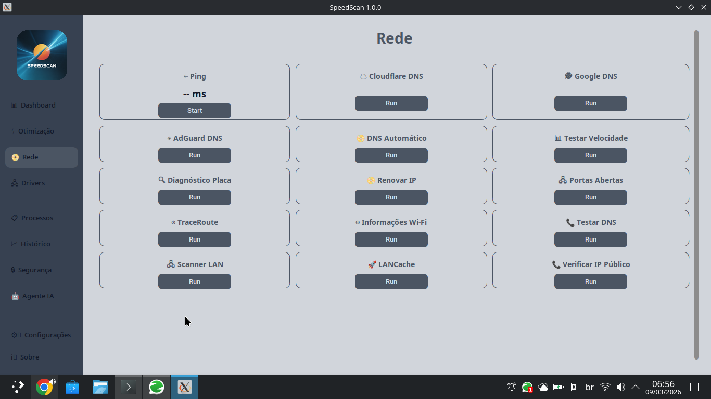

# ⚡ SpeedScan


SpeedScan é uma ferramenta de diagnóstico e otimização de sistemas desenvolvida em Python com CustomTkinter. Oferece monitoramento em tempo real, otimização de desempenho, configuração de rede e diagnóstico de drivers, tudo em uma interface moderna e intuitiva.

## ✨ Funcionalidades

- **Monitoramento do Sistema**: CPU, RAM, GPU, discos, uptime e bateria
- **Otimização**: Limpeza de cache, reset de swap, verificação de erros
- **Modo Turbo**: Ajusta o governador de CPU para máxima performance (Linux) ou plano de energia (Windows)
- **Rede**: Teste de ping, configuração de DNS (Cloudflare, Google, AdGuard), traceroute, informações Wi-Fi
- **Drivers**: Diagnóstico de hardware, atualização de drivers de vídeo/rede
- **Agente IA**: Conexão com modelos de IA (DeepSeek, GPT, Gemini, etc.) e configuração local (Ollama)
- **Temas**: Personalização com temas dark/light e reinicialização instantânea

## 📸 Capturas de Tela

| Sistema | Otimização | Rede |
|--------|------------|------|
|  |  |  |

*Nota: As imagens acima são apenas ilustrativas. Substitua pelos prints reais do software.*

## 🖥️ Plataformas Suportadas

| Sistema | Status | Observações |
|---------|--------|-------------|
| 🐧 Linux | ✅ Funcional | Testado em Fedora, Solus, openSUSE |
| 🪟 Windows | ✅ Funcional | Requer winget para instalação de apps |
| 🍏 macOS | ✅ Funcional | Requer Homebrew para instalação de apps |
| 📱 Android | 🚧 Em desenvolvimento | Versão separada com Kivy/BeeWare |

## 🚀 Instalação

### Linux

```bash
# via curl (recomendado)
curl -sSL https://raw.githubusercontent.com/ewertonvasconcelos/speedscan/main/install.sh | bash

# ou manualmente
git clone https://github.com/ewertonvasconcelos/speedscan.git
cd speedscan
pip install -r requirements.txt
python3 core/speedscan_app.py
