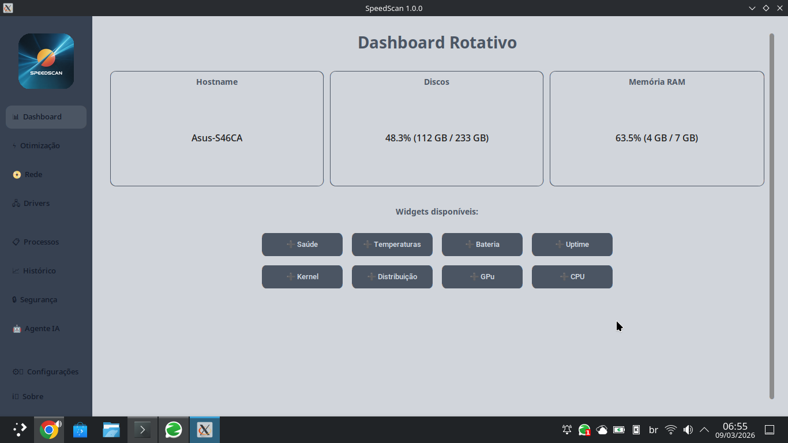
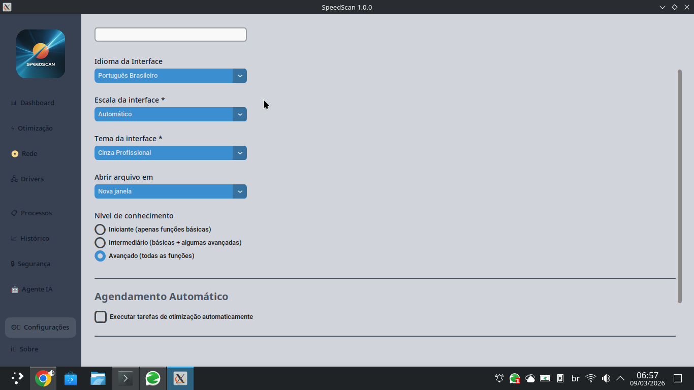
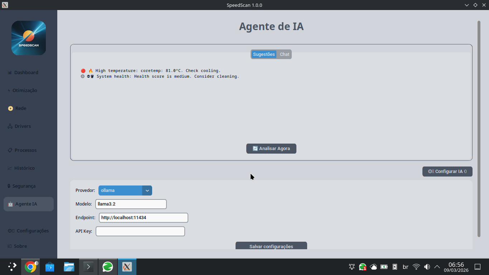

# ⚡ SpeedScan

<div align="center">
  
  <br>
  <strong>Ferramenta all-in-one de diagnóstico e otimização de sistema com IA integrada</strong>
</div>

<p align="center">
  
  
  
  
</p>

## 📋 Índice
- [Sobre o Projeto](#sobre-o-projeto)
- [Funcionalidades](#-funcionalidades)
- [Capturas de Tela](#-capturas-de-tela)
- [Tecnologias Utilizadas](#-tecnologias-utilizadas)
- [Instalação e Uso](#-instalação-e-uso)
- [Como Contribuir](#-como-contribuir)
- [Roadmap](#-roadmap)
- [Licença](#-licença)

## 📖 Sobre o Projeto
O SpeedScan nasceu da necessidade de ter uma ferramenta centralizada para diagnosticar e otimizar sistemas. Ele oferece desde informações detalhadas de hardware até um dashboard interativo e sugestões de melhorias baseadas em IA. É o canivete suíço para quem quer manter o computador sempre no máximo desempenho.

## ⚙️ Funcionalidades
- **Dashboard Rotativo:** Acompanhe CPU, RAM, Disco e mais em widgets personalizáveis.
- **Monitoramento em Tempo Real:** Temperaturas, saúde dos discos (S.M.A.R.T.) e processos.
- **Otimização do Sistema:** Limpeza de cache, reset de swap e modo turbo.
- **Análise de Rede:** Teste de velocidade, scanner de LAN e configuração de DNS.
- **Gerenciador de Processos:** Visualize e gerencie processos em execução.
- **IA Proativa:** Receba sugestões inteligentes para otimizar seu sistema.
- **Segurança:** Verificação de portas abertas, status do firewall e atualizações de segurança.
- **LANCache:** Acelere seus downloads de jogos com um cache local.
- **Temas Customizáveis:** Escolha entre temas claro e escuro.

## 🖼️ Capturas de Tela
<p align="center">
  
  
  
  
  <p><em>Exemplo do Dashboard, aba de Otimização,aba do Agente IA e Configurações.</em></p>
</p>

## 🛠️ Tecnologias Utilizadas


## 💻 Instalação e Uso
Siga estes passos para rodar o SpeedScan no seu ambiente local:

1.  **Clone o repositório**
    ```bash
    git clone https://github.com/ewertonvasconcelos/speedscan.git
    cd speedscan
